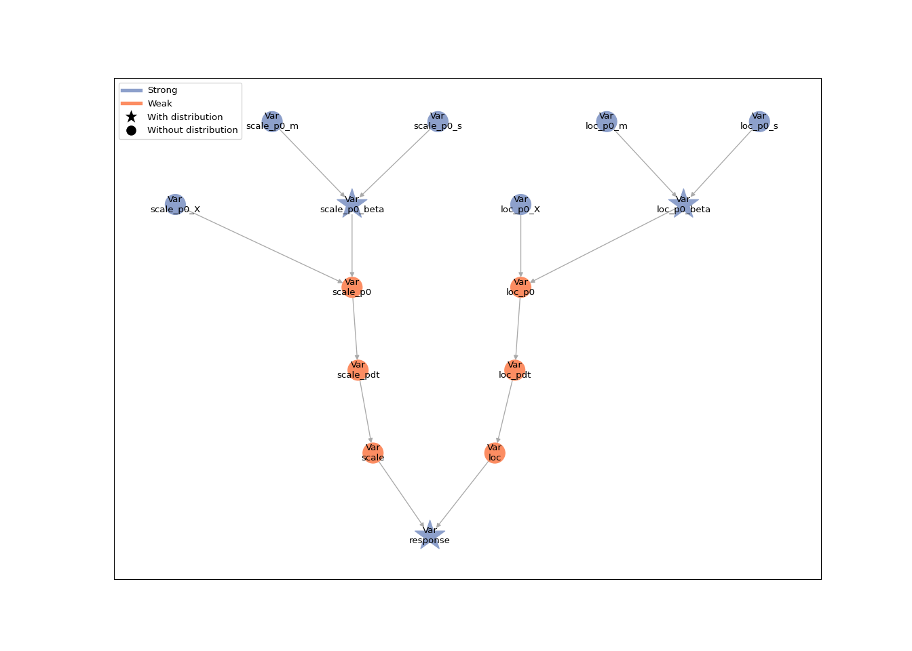
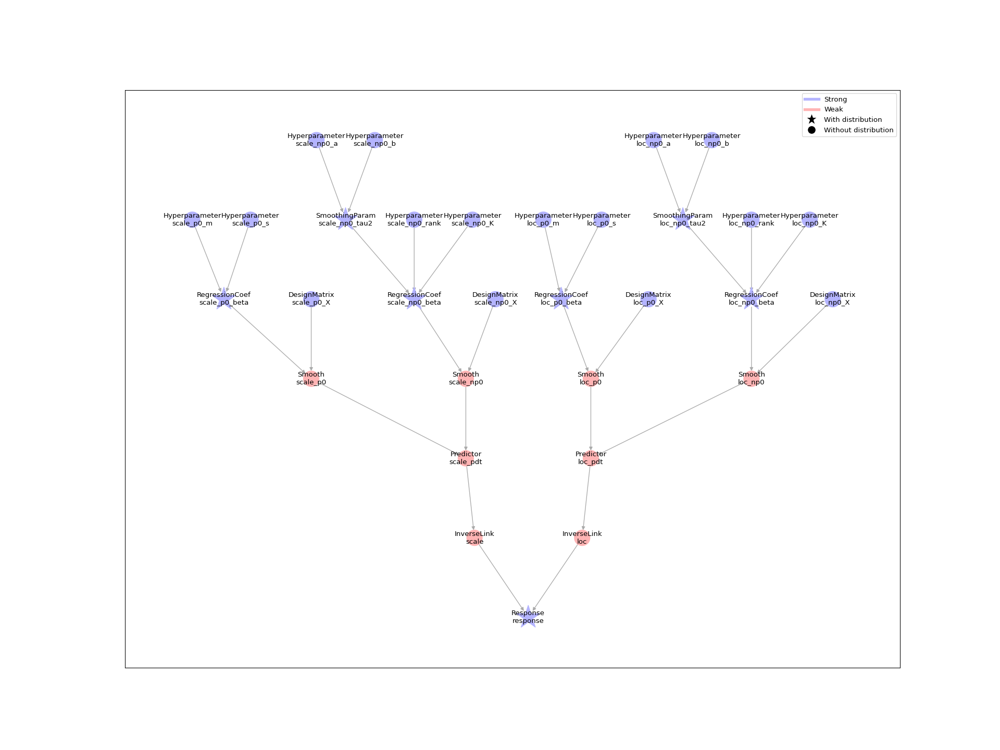

<!-- README.md is generated from README.Rmd. Please edit that file -->

# RLiesel

<!-- badges: start -->
<!-- badges: end -->

The goal of RLiesel is to provide an R interface for the probabilistic
programming framework [Liesel](https://github.com/liesel-devs/liesel).

RLiesel assists the user in expressing semi-parametric regression models
as probabilistic graphical models (PGMs). It supports generalized
additive models for location, scale and shape (GAMLSS) with different
response distributions, spline-based smooth terms and shrinkage priors.
In a second step, the models can be transferred to Python for the
further analysis.

## Installation

You can install the development version of RLiesel by running the
following commands:

``` r
# install.packages("devtools")
devtools::install_github("liesel-devs/rliesel")
```

## Usage

``` r
library(rliesel)
```

The `liesel()` function is the workhorse of RLiesel and can be used to
set up semi-parametric regression models. We illustrate the flexibility
of the function by means of two examples.

### A linear model

In the first example, we assume a linear relationship between the mean
and the log-standard deviation of a response variable `y` and an
explanatory variable `x`.

``` r
# generate some data
set.seed(1337)

n <- 250
x <- runif(n)
y <- rnorm(n, mean = x, sd = exp(x))
```

The regression predictors of the distributional parameters are specified
with the `predictor()` function. The predictors are then passed to the
`predictors` argument of the `liesel()` function as a named list.
Finally, the conditional distribution of the response variable needs to
be defined via the `distribution` argument:

``` r
linear_mod <- liesel(
  response = y,
  distribution = "Normal",
  predictors = list(
    loc = predictor(~x, inverse_link = "Identity"),
    scale = predictor(~x, inverse_link = "Exp")
  )
)
```

The hierarchical structure of a Liesel model can be visualized with the
generic `plot()` function:

``` r
plot(linear_mod)
```



The attributes of the Python model object such as the nodes or the
log-probability can be accessed in R with the `$` operator,
e.g. `linear_mod$nodes$loc_p1_beta$value` or `linear_mod$log_prob`.

### A generalized additive model (GAM)

In the second example, both the location and the scale parameter are
connected to the explanatory variable `x` through a smoothing spline:

``` r
y <- rnorm(n, mean = sin(2 * pi * x), sd = exp(sin(2 * pi * x)))

spline_mod <- liesel(
  response = y,
  distribution = "Normal",
  predictors = list(
    loc = predictor(~s(x), inverse_link = "Identity"),
    scale = predictor(~s(x), inverse_link = "Exp")
  )
)

## plot(spline_mod)
```



Users who are familiar with the `mgcv` package may recognize the syntax
from the `gam()` function, which can be used to set up an equivalent
model as follows:

``` r
library(mgcv)
gam(list(y ~ s(x), ~s(x)), family = gaulss())
```

Finally, the Liesel model can be saved to a pickle file with the
`save_model()` command:

``` r
save_model(spline_mod, "spline-mod.pickle")
```
